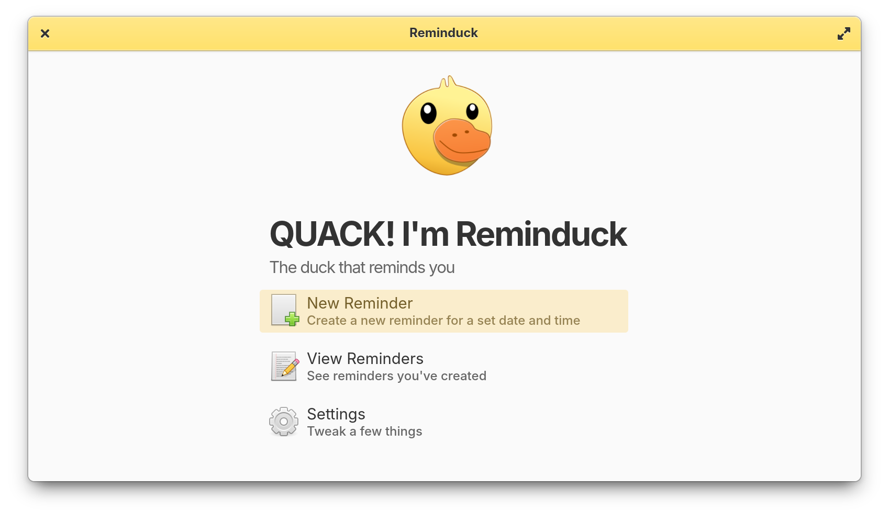

<div align="center">
    
  <h1>Reminduck</h1>
  <h3>Remember your stuff in an adorably annoying way</h3>
<span align="center"> </span>
</div>

Reminduck is a simple reminder app made to be quick and easy - it focuses on simple or recurrent reminders with set time and date and nothing else.

It's perfect if all you want are simple or daily/weekly/monthly reminders. Anything more than that is not achievable by Reminduck right now - but you can help! Open an issue or a pull request if you have any ideas or requests.

_And it quacks._

  <a href="https://elementary.io">
    
  </a>

## Installation

You can download and install Reminduck from various sources:

[](https://appcenter.elementary.io/io.github.elly_codes.reminduck) 
[](https://flathub.org/apps/io.github.elly_codes.reminduck)


## 🛣️ Roadmap

 - Change the deprecated widgets
 - Clean everything up a bit and simplify
 - Work on some old bugs


## 💝 Donations

You can donate to various contributors:
 - Matfantinel, the initial creator of the app (https://github.com/matfantinel)
 - teamcons, the main devs and maintainers behind Cherrypick (https://ko-fi.com/teamcons)


## 🏗️ Building

On elementary OS or with its appcenter remote installed

```bash
flatpak-builder --force-clean --user --install-deps-from=appcenter --install builddir ./io.github.elly_codes.reminduck.yml
```

On other systems

```bash
flatpak run org.flatpak.Builder --force-clean --sandbox --user --install --install-deps-from=flathub --ccache --mirror-screenshots-url=https://dl.flathub.org/media/ --repo=repo builddir io.github.elly_codes.reminduck.flathub.yml
```

## ACKNOWLEDGMENTS

Quack sound: https://pixabay.com/sound-effects/075176-duck-quack-40345/

Sound Effect by <a href="https://pixabay.com/users/freesound_community-46691455/?utm_source=link-attribution&utm_medium=referral&utm_campaign=music&utm_content=40345">freesound_community</a> from <a href="https://pixabay.com//?utm_source=link-attribution&utm_medium=referral&utm_campaign=music&utm_content=40345">Pixabay</a>

Ducktoy https://quicksounds.com/sound/22456/duck-toy-sound
